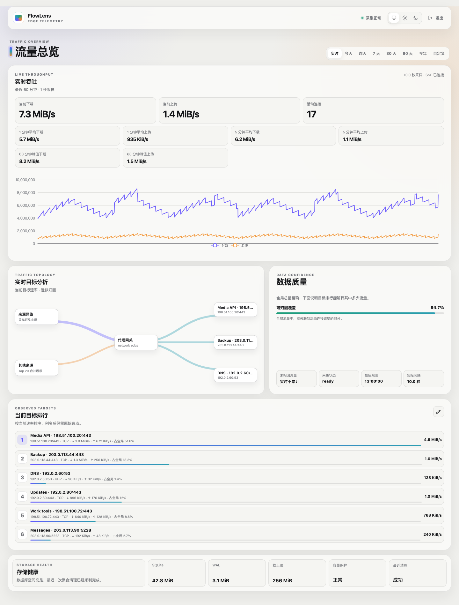

# FlowLens

FlowLens 是一个面向 sing-box Clash API 的自托管流量仪表盘。它将可靠的全局累计流量保存到 SQLite，同时展示实时速度、历史趋势、连接归因、数据质量和存储状态。

<picture>
  <source media="(prefers-color-scheme: dark)" srcset="assets/flowlens-dark.png">
  <source media="(prefers-color-scheme: light)" srcset="assets/flowlens-light.png">
  
</picture>

## 功能

- 实时上传/下载速度、1/5 分钟均值、60 分钟峰值和活动连接数。
- 今天、昨天、7/30/90 天、今年和自定义范围的历史统计。
- 目标 IP、Endpoint、端口、TCP/UDP、来源网段和域名六类近似归因，以及覆盖率和未归因流量。
- host/endpoint 展示别名、静态流量拓扑和存储健康视图。
- System、Light、Dark 三种主题和移动端响应式布局。
- 严格 YAML 配置、可选共享密钥登录、内存 Cookie 会话、健康和就绪检查。
- SQLite 多级聚合、保留清理、容量保护与经过校验的本地备份。
- 单个 Go 服务嵌入 React 前端；运行时不需要 Node.js 或 Nginx。

## 快速开始

运行 FlowLens 需要 Docker、Docker Compose、已启用 Clash API 的 sing-box，以及两者共同加入的 Docker 用户自定义网络。

```bash
cp config/config.example.yaml config/config.yaml
mkdir -p data
docker network create flowlens_private
```

编辑 `config/config.yaml`：

- 将 `clash_api.url` 和 `clash_api.secret` 设置为私有 Docker 网络中 sing-box 的 Clash API 地址和 Secret。
- 默认保持 `auth.enabled: true`，并为 `auth.access_key` 设置至少 16 个字符的登录密钥，例如使用 `openssl rand -base64 16` 生成。仅可信局域网可设置 `auth.enabled: false` 并省略登录密钥。
- 按部署位置设置 `time.timezone`，并检查存储、保留期、隐私和备份选项。

在 Linux 上确保固定容器用户可以读取配置并写入数据目录：

```bash
sudo chown 10001:10001 config/config.yaml data
chmod 600 config/config.yaml
chmod 700 data
```

让 sing-box 加入 `flowlens_private`，然后拉取并启动已发布镜像：

```bash
FLOWLENS_IMAGE=ghcr.io/willxup/flowlens:v0.2.2 \
  docker compose -f docker-compose.example.yml pull
FLOWLENS_IMAGE=ghcr.io/willxup/flowlens:v0.2.2 \
  docker compose -f docker-compose.example.yml up -d
```

打开 [http://127.0.0.1:8080](http://127.0.0.1:8080)。认证开启时使用 `auth.access_key` 登录；认证关闭时直接进入仪表盘。Compose 默认只将 FlowLens 发布到宿主机 loopback，不会发布 Clash API。

完整配置说明见 [`config/config.example.yaml`](config/config.example.yaml)。FlowLens 固定读取 `/etc/flowlens/config.yaml`；Compose 将配置只读挂载，并把 SQLite 数据和备份保存在 `./data/`。

## 运行与维护

检查容器内 Web 健康状态：

```bash
docker compose -f docker-compose.example.yml exec flowlens /flowlens healthcheck
```

`doctor` 是离线检查：它会取得数据目录锁，只读检查配置、已有 SQLite 数据库及必要的 Clash API 能力，不会创建数据库或执行迁移。先停止正在运行的实例：

```bash
docker compose -f docker-compose.example.yml stop flowlens
docker compose -f docker-compose.example.yml run --rm flowlens doctor
docker compose -f docker-compose.example.yml up -d
```

FlowLens 会按 `backup.local_time` 自动创建经过校验的本地备份，并按 `daily_keep`、`monthly_keep` 保留。手动备份同样需要独占数据目录，因此要短暂停止服务：

```bash
docker compose -f docker-compose.example.yml stop flowlens
docker compose -f docker-compose.example.yml run --rm flowlens backup
docker compose -f docker-compose.example.yml up -d
```

恢复前先停止服务，并对清单做完整校验。清单路径必须使用容器内绝对路径：

```bash
docker compose -f docker-compose.example.yml stop flowlens
docker compose -f docker-compose.example.yml run --rm flowlens \
  restore --check /var/lib/flowlens/backups/flowlens-YYYYMMDDTHHMMSSZ.manifest.json
docker compose -f docker-compose.example.yml run --rm flowlens \
  restore --output /var/lib/flowlens/restored.db \
  /var/lib/flowlens/backups/flowlens-YYYYMMDDTHHMMSSZ.manifest.json
```

`restore --output` 只创建不存在的新数据库，绝不会覆盖配置中的活动数据库。确认恢复文件后，在宿主机保存原 `data/flowlens.db*`，把 `data/restored.db` 原子替换为 `data/flowlens.db`，再启动并运行 `doctor`。

升级前建议先运行一次手动备份，然后更新镜像标签：

```bash
FLOWLENS_IMAGE=ghcr.io/willxup/flowlens:v0.2.2 \
  docker compose -f docker-compose.example.yml pull
FLOWLENS_IMAGE=ghcr.io/willxup/flowlens:v0.2.2 \
  docker compose -f docker-compose.example.yml up -d
```

FlowLens 在需要迁移数据库时会先创建升级前快照。不要跨版本跳过备份，也不要在两个 FlowLens 实例之间共享同一个数据目录。

## 数据语义

- `/connections` 累计计数器是精确全局字节的唯一来源；`/traffic` 只生成实时速度样本。
- 实时一秒样本只保留在内存中，不伪装成历史流量；历史查询只读取 SQLite 聚合。
- 首次观测只建立基线，不回填此前流量；计数器回退开始新的运行会话。
- 采集缺口会明确记录为数据质量事件，不会被填成零流量。
- 全局总量是精确值；连接维度受 Clash API 可见性和 Top K 截断影响，界面会明确标记为近似值。

## 安全与隐私

- FlowLens 不修改 sing-box 配置、路由、防火墙或代理连接。
- 登录密钥、Clash Secret 和会话不会写入 URL 或浏览器存储。
- `auth.enabled: false` 会开放仪表盘及全部业务 API，只能用于可信局域网。
- FlowLens 不内置 TLS；如需远程访问，请在可信反向代理后提供 HTTPS。
- 容器以 `10001:10001` 运行，最终镜像为 scratch；示例 Compose 使用只读根文件系统并移除全部 Linux capabilities。
- 不要提交真实 `config/config.yaml`、Secret、Cookie、数据库、备份或未脱敏日志。

## 故障排查

- `healthcheck` 失败：确认容器正在运行、`server.listen` 端口与 Compose 容器端口一致。
- `doctor` 的 storage 检查失败：确认数据卷权限为 `10001:10001`，数据库存在，且没有第二个 FlowLens 实例占用同一目录。
- Clash API 检查失败：确认 sing-box 与 FlowLens 在同一私有网络、URL 使用服务名和显式端口、Secret 完全一致，并已启用 Clash API。
- 页面显示采集降级：查看数据质量事件；缺失区间不会被伪装为零流量。
- 达到存储软上限：FlowLens 会优先停止创建新的具体维度并保留精确全局数据；调整保留期或软上限后重启。

公开 HTTP 契约见 [`api/openapi.yaml`](api/openapi.yaml)，实时事件语义见 [`docs/api-sse.md`](docs/api-sse.md)。安全问题请按 [`SECURITY.md`](SECURITY.md) 私下报告。

## 开发

开发环境使用 Go 1.26.2、Node.js 24.14.0 和 pnpm 11.9.0。可重定向的缓存与测试产物统一放在 `.flowlens-dev/`。

```bash
corepack enable
make deps
make check
make frontend-e2e
```

## License

[MIT](LICENSE)
