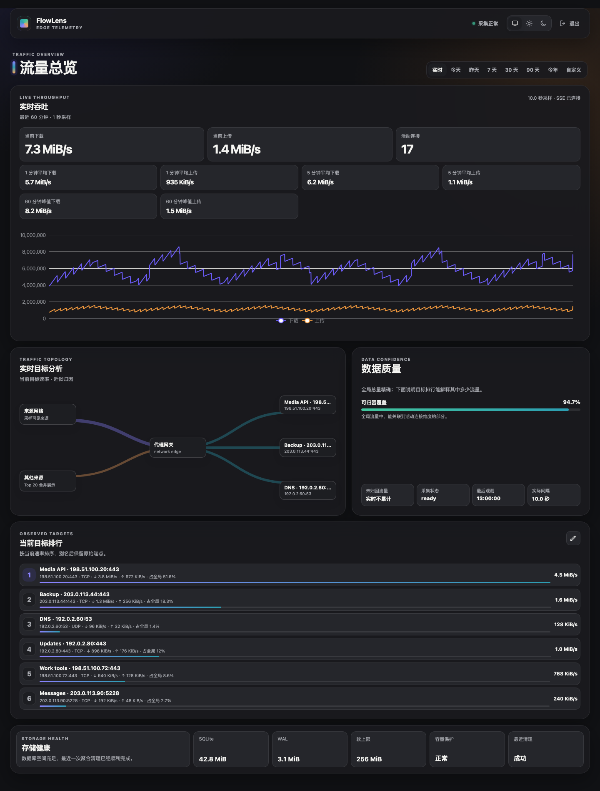

# FlowLens

FlowLens 是一个面向 sing-box Clash API 的自托管流量仪表盘。它将可靠的全局累计流量保存到 SQLite，同时展示实时速度、历史趋势、连接归因、数据质量和存储状态。

[在线 Demo](https://willxup.github.io/flowlens/) 使用固定的 RFC 文档地址和完全离线的数据，不会连接任何真实代理服务。


<details>
<summary>深色主题</summary>



</details>

## 功能

- 实时上传/下载速度、1/5 分钟均值、60 分钟峰值和活动连接数。
- 今天、昨天、7/30/90 天、今年和自定义范围的历史统计。
- 目标 IP、Endpoint、端口、TCP/UDP、来源网段和域名六类近似归因，以及覆盖率和未归因流量。
- host/endpoint 展示别名、静态流量拓扑和存储健康视图。
- System、Light、Dark 三种主题和移动端响应式布局。
- 严格 YAML 配置、共享密钥登录、内存 Cookie 会话、健康和就绪检查。
- SQLite 多级聚合、保留清理、容量保护与经过校验的本地备份。
- 单个 Go 服务嵌入 React 前端；运行时不需要 Node.js 或 Nginx。

## 快速开始

运行 FlowLens 需要 Docker、Docker Compose、已启用 Clash API 的 sing-box，以及两者共同加入的 Docker 用户自定义网络。

```bash
cp config/config.example.yaml config/config.yaml
mkdir -p data
docker network create flowlens_private
```

编辑 `config/config.yaml`：

- 将 `clash_api.url` 和 `clash_api.secret` 设置为私有 Docker 网络中 sing-box 的 Clash API 地址和 Secret。
- 为 `auth.access_key` 设置至少 16 个字符的登录密钥，例如使用 `openssl rand -base64 16` 生成。
- 按部署位置设置 `time.timezone`，并检查存储、保留期、隐私和备份选项。

在 Linux 上确保固定容器用户可以读取配置并写入数据目录：

```bash
sudo chown 10001:10001 config/config.yaml data
chmod 600 config/config.yaml
chmod 700 data
```

让 sing-box 加入 `flowlens_private`，然后构建并启动：

```bash
docker compose -f docker-compose.example.yml up -d --build
```

打开 [http://127.0.0.1:8080](http://127.0.0.1:8080)，使用 `auth.access_key` 登录。Compose 默认只将 FlowLens 发布到宿主机 loopback，不会发布 Clash API。

完整配置说明见 [`config/config.example.yaml`](config/config.example.yaml)。FlowLens 固定读取 `/etc/flowlens/config.yaml`；Compose 将配置只读挂载，并把 SQLite 数据和备份保存在 `./data/`。

## 数据语义

- `/connections` 累计计数器是精确全局字节的唯一来源；`/traffic` 只生成实时速度样本。
- 实时一秒样本只保留在内存中，不伪装成历史流量；历史查询只读取 SQLite 聚合。
- 首次观测只建立基线，不回填此前流量；计数器回退开始新的运行会话。
- 采集缺口会明确记录为数据质量事件，不会被填成零流量。
- 全局总量是精确值；连接维度受 Clash API 可见性和 Top K 截断影响，界面会明确标记为近似值。

## 安全与隐私

- FlowLens 不修改 sing-box 配置、路由、防火墙或代理连接。
- 登录密钥、Clash Secret 和会话不会写入 Demo、URL 或浏览器存储。
- FlowLens 不内置 TLS；如需远程访问，请在可信反向代理后提供 HTTPS。
- 容器以 `10001:10001` 运行，最终镜像为 scratch；示例 Compose 使用只读根文件系统并移除全部 Linux capabilities。
- 不要提交真实 `config/config.yaml`、Secret、Cookie、数据库、备份或未脱敏日志。

## 开发

开发环境使用 Go 1.26.2、Node.js 24.14.0 和 pnpm 11.9.0。可重定向的缓存与测试产物统一放在 `.flowlens-dev/`。

```bash
corepack enable
make deps
make check
make frontend-e2e
```

## License

[MIT](LICENSE)
