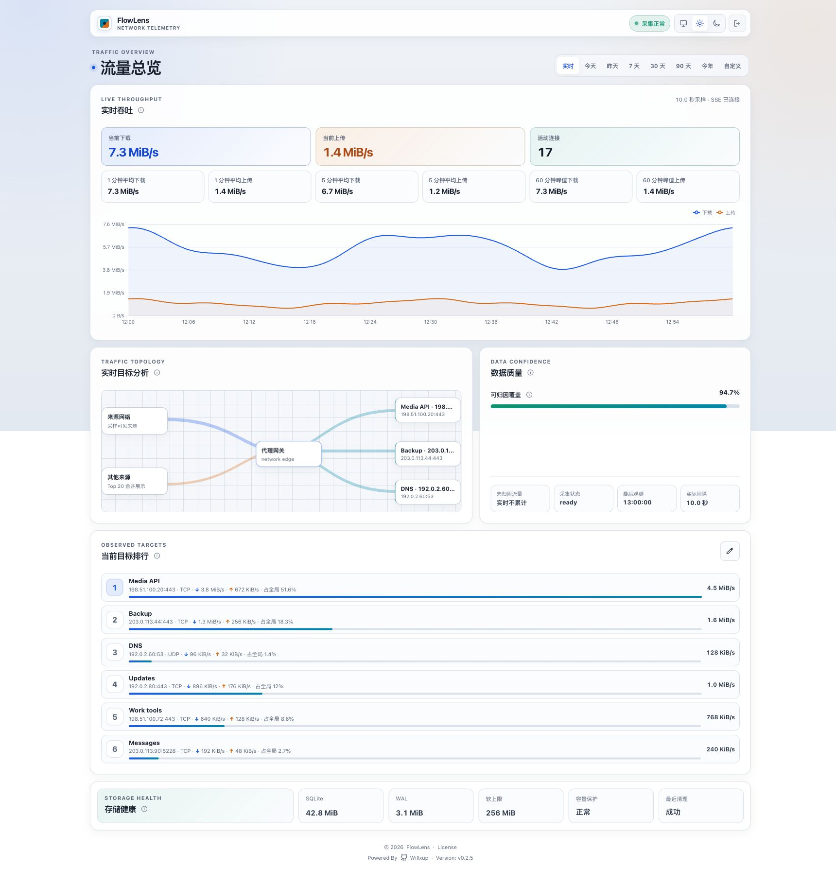

<p align="center">
  <picture>
    <source media="(prefers-color-scheme: dark)" srcset="./assets/flowlens-brand-dark.svg" />
    <source media="(prefers-color-scheme: light)" srcset="./assets/flowlens-brand-light.svg" />
    
  </picture>
</p>

<p align="center">
  <a href="./README.md">English</a> ｜ <a href="./README.zh.md"><strong>简体中文</strong></a>
</p>

<h1 align="center">FlowLens</h1>

<p align="center">看见每一字节的去向。</p>

<p align="center">
  <a href="https://github.com/Willxup/flowlens/releases/latest"></a>
  <a href="https://github.com/Willxup/flowlens/actions/workflows/ci.yml"></a>
  <a href="https://github.com/Willxup/flowlens/pkgs/container/flowlens"></a>
  
  <a href="./LICENSE"></a>
</p>

FlowLens 是一个面向 sing-box Clash API 的自托管流量仪表盘。它精确保存全局流量，通过采样连接维度解释流量去向，并由单个 Go 进程配合 SQLite 提供响应式 React 界面；它不会修改 sing-box、路由、防火墙或代理连接。

> 发布镜像使用不可变版本标签和可变的 `latest` 标签；生产部署应固定不可变版本标签或 digest。

## 界面预览

<p align="center">
  <picture>
    <source media="(prefers-color-scheme: dark)" srcset="./assets/flowlens-dark.png" />
    <source media="(prefers-color-scheme: light)" srcset="./assets/flowlens-light.png" />
    
  </picture>
</p>

## 功能特性

- 查看实时上传下载速度、移动平均、60 分钟峰值和活动连接
- 查询今天、昨天、7/30/90 天、今年和自定义历史范围
- 按目标、Endpoint、端口、协议、来源网段和域名归因流量
- 明确区分精确全局流量、近似连接归因、Top K 截断和未归因流量
- 使用 SQLite 多级聚合、保留策略、容量保护、完整性检查和经过校验的本地备份
- 查看运行会话、采集缺口、归因覆盖率和当前存储健康状态
- 通过共享密钥会话保护 Web 界面，也可显式启用可信局域网模式
- 以非 root、只读、多架构容器运行，并将 React 应用嵌入单个 Go 二进制文件

## 快速开始

推荐使用 Docker Compose 运行生产实例。FlowLens 还需要一个已启用 Clash API 的 sing-box，以及两者共同使用的 Docker 网络。

```bash
git clone https://github.com/Willxup/flowlens.git
cd flowlens

cp config/config.example.yaml config/config.yaml
mkdir -p data
docker network create flowlens_private
```

编辑 `config/config.yaml` 并配置：

- 可访问的 sing-box Clash API 对应的 `clash_api.url` 和 `clash_api.secret`
- 启用认证时至少 16 个字符的 `auth.access_key`
- 数据库首次写入流量记录之前确定 `time.timezone`

让 sing-box 加入 `flowlens_private`，然后使用不可变发布镜像启动 FlowLens：

```bash
export FLOWLENS_IMAGE=ghcr.io/willxup/flowlens:v0.2.5

docker compose -f docker-compose.example.yml pull
docker compose -f docker-compose.example.yml up -d
```

打开 [http://127.0.0.1:8080](http://127.0.0.1:8080)。示例 Compose 默认只监听宿主机 loopback。

生产环境应通过可信反向代理提供 HTTPS；除非网络已明确受信，否则应保持认证开启，并备份完整的 `data` 目录。对外开放或升级服务前请先阅读[运维指南](./docs/operations.md)。

## 设计边界

| 范围 | 实现方式 |
| --- | --- |
| 运行时 | 单个 Go 进程并嵌入 React 应用 |
| 遥测来源 | 通过 HTTP 读取 sing-box Clash API `/connections` 快照 |
| 全局流量 | 基于 Clash API 累计计数器差值的精确上传和下载流量 |
| 流量归因 | 采样连接维度，并使用 Top K、`_other` 和 `_unattributed` 分桶 |
| 历史数据 | `/var/lib/flowlens` 中的 SQLite 多级聚合 |
| 实时界面 | 内存一秒样本，通过同源 SSE 推送到浏览器 |
| 来源隐私 | 可保存完整地址、网段前缀或禁用；默认使用网段前缀 |
| 平台 | `linux/amd64`、`linux/arm64` |

FlowLens 只负责观测。它不会配置 sing-box、对外暴露 Clash API 或修改主机网络。不要让两个 FlowLens 实例写入同一个数据目录；数据库已有流量数据后也不要修改配置时区。

## 本地开发

### 前置依赖

- Go 1.26.2
- Node.js 24.14.0
- pnpm 11.9.0

### 构建与验证

```bash
corepack enable
make deps
make check
make frontend-e2e
```

无需 sing-box 即可运行 deterministic 前端演示：

```bash
pnpm --dir web dev:demo
```

项目缓存、工具、测试报告和临时文件都保存在 `.flowlens-dev/` 下。

## 文档导航

| 主题 | 文档 |
| --- | --- |
| 完整配置项与安全说明 | [配置示例](./config/config.example.yaml) |
| Docker 部署、健康检查、备份、恢复、升级与排障 | [运维指南](./docs/operations.md) |
| Server-Sent Events 与重连行为 | [SSE 事件](./docs/api-sse.md) |
| HTTP API 契约 | [OpenAPI](./api/openapi.yaml) |
| 漏洞报告与安全边界 | [安全策略](./SECURITY.md) |

## 许可证

本项目基于 [MIT License](./LICENSE) 开源。
